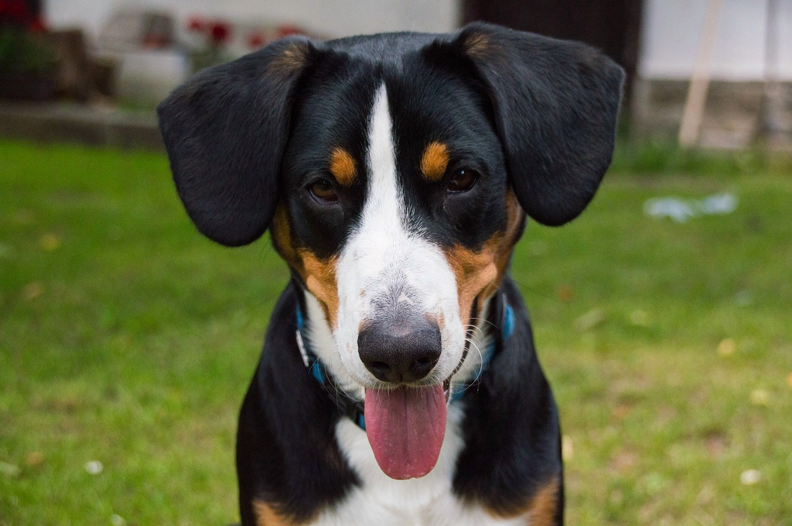
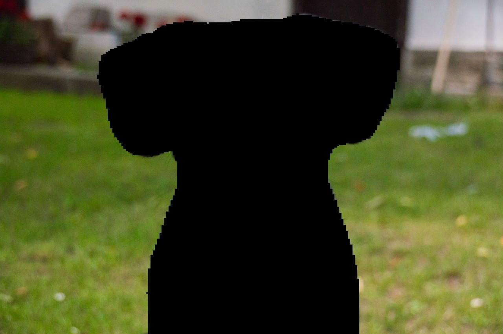

<!--
Copyright (c) 2023, NVIDIA CORPORATION & AFFILIATES. All rights reserved.

Licensed under the Apache License, Version 2.0 (the "License");
you may not use this file except in compliance with the License.
You may obtain a copy of the License at

    http://www.apache.org/licenses/LICENSE-2.0

Unless required by applicable law or agreed to in writing, software
distributed under the License is distributed on an "AS IS" BASIS,
WITHOUT WARRANTIES OR CONDITIONS OF ANY KIND, either express or implied.
See the License for the specific language governing permissions and
limitations under the License.
-->

# ResNet101 PyTorch segmentation example

## Overview

The example presents an inference scenario using DALI and ResNet101.

DALI is a portable, holistic framework for GPU-accelerated data loading and augmentation in deep learning workflows.
DALI supports processing images, videos, and audio data. The key features are: straightforward integration with Triton
Inference Server (using [DALI Backend](https://github.com/triton-inference-server/dali_backend)), 
framework-agnostic processing implementation, batched processing, wide collection of operations and graph-based pipeline 
implementation approach.

ResNet101 is a segmentation model. Together with DALI on board they form the following scenario:
1. **Preprocessing** - DALI-based typical ResNet preprocessing. Includes image decoding, resize and normalization.
2. **Inference** - the model returns the probabilities of a given class in every pixel.
3. **Postprocessing** - DALI takes the original image and the probabilities and extracts a particular class.

Every step mentioned above is executed by the Triton server. Triton client is used only for reading the test
data from disk and handling the result.

The example consists of following files:

- `server.py` - start the model with Triton Inference Server,
- `client.py` - execute HTTP/gRPC requests to the deployed model,
- `model_inference.py` - ResNet101 inference with PyTorch,
- `Dockerfile` - define docker image used to execute the example.

## Current limitations

After the postprocessing stage, the original and segmented images are sent back to the client. The typical deep learning
approach is to infer (or train) data in batches. Since images tend to have various shapes, the output batch will not
have uniform shape (is going to be, e.g. 2 images with shapes `(1281, 851, 3)` and `(640, 426, 3)`). Triton Inference
Server handles such batches using
[ragged batching](https://github.com/triton-inference-server/server/blob/main/docs/user_guide/ragged_batching.md)
feature. Unfortunately, PyTriton does not support it yet. Therefore this example is limitted to `batch_size=1`.

## Running example

### Prerequisities
This example assumes the following dependencies installed in your system:
1. Docker
2. Triton Python client module (`pip install tritonclient`)

### Run

To run this example, please follow these steps:
1. Build docker image for the Triton server:
```shell
$ docker build -t pytriton_dali .
```
2. Run the docker container based on the image built in the previous step:
```shell
$ docker run -it --gpus all --shm-size 8gb -v $(pwd):/dali -w /dali --net host pytriton_dali bash
```
3. Inside the container start the Triton server:
```shell
$ python server.py
```
4. In a new terminal window run the Triton client:
```shell
$ python client.py
```

### Extra options

The `client.py` script accepts extra options, listed below:
1. `--dump-images` - If specified, the original and segmented images will be saved to disk (in a current directory).
2. `--image-paths` - If specified, these paths will be used as the input data for the processing, 
instead of the default sample.

## The result

Original image:



Segmented image:

